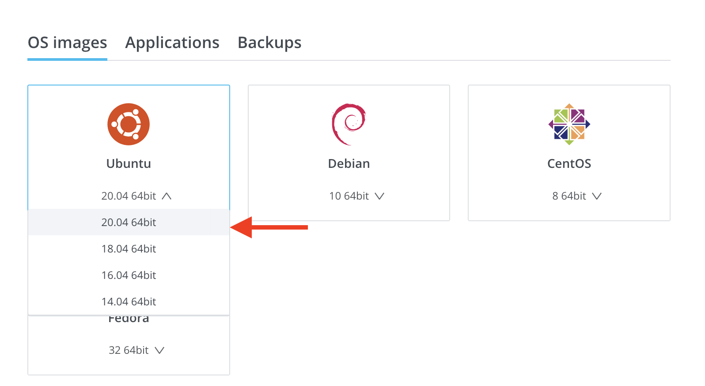
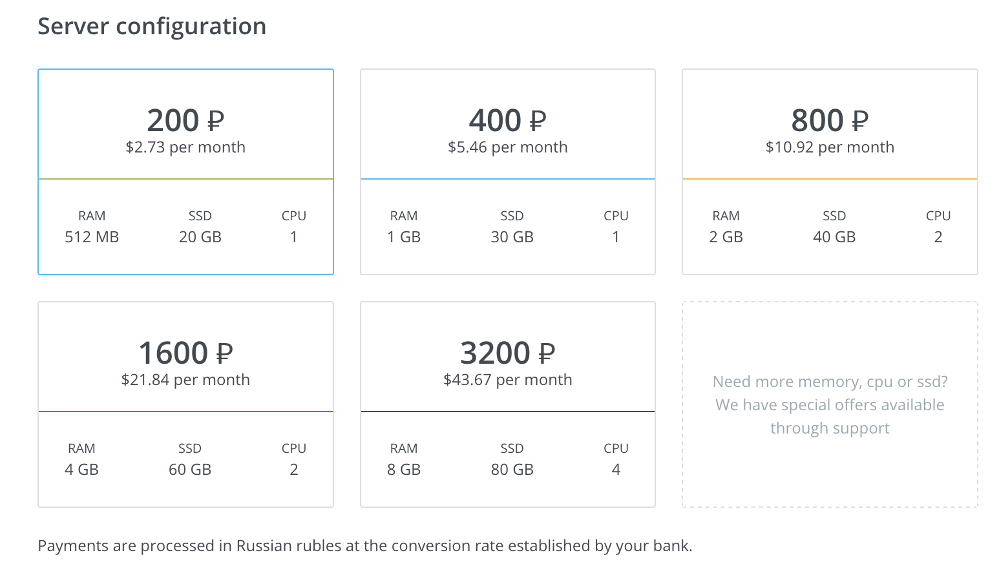
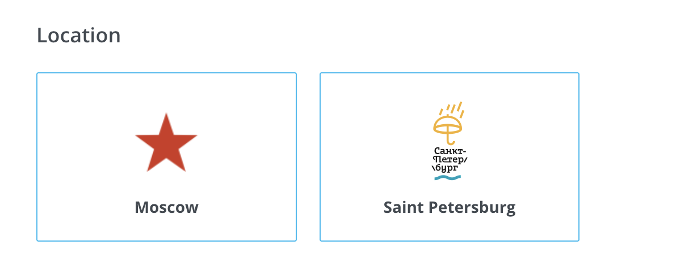
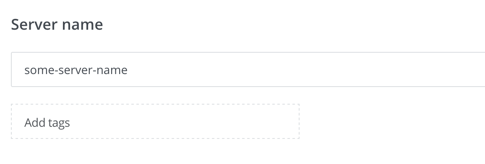
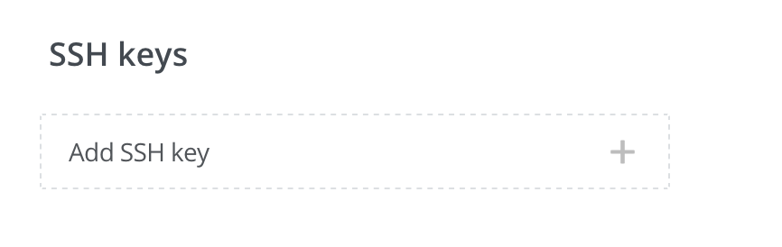
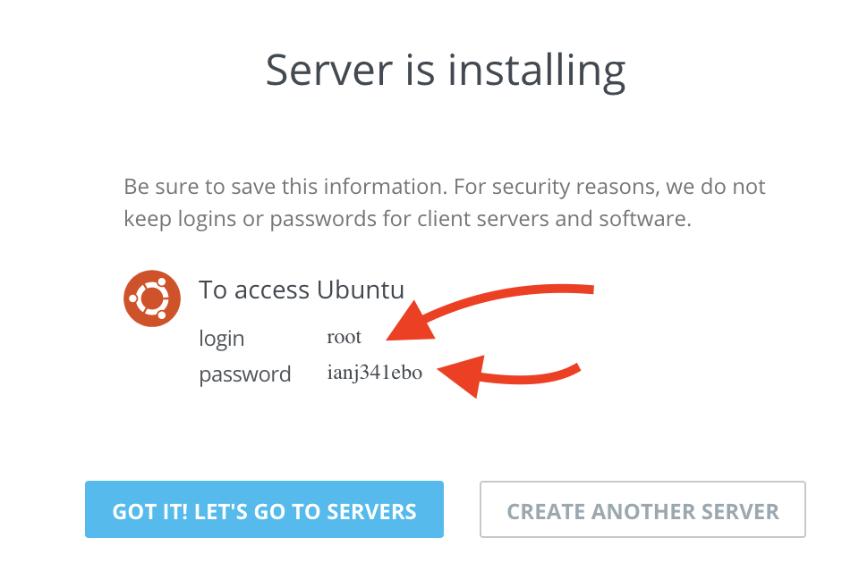
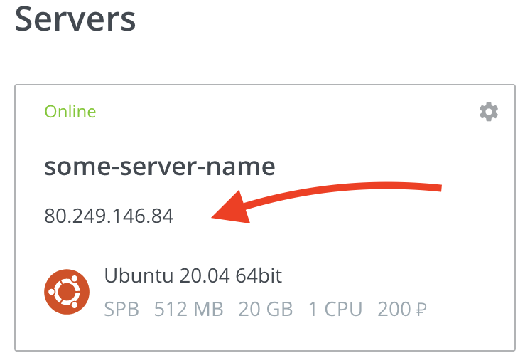

Как выгрузить Ephyr re-streamer на VScale/Selectel Cloud
==============================================================

Это инструкция по основному и рекомендуемому способу выгрузки приложения Ephyr re-streamer на [VScale/Selectel Cloud] хостинг.

Этот вариант выгрузки может быть интересен тем, что [VScale/Selectel Cloud] предлагает сервера в локациях Москва и Санкт-Петербург.

> __ВНИМАНИЕ__: Для установки Ephyr re-streamer необходимо заходить на сервер!


## 0. Перед началом

У Вас должен быть зарегистрированный аккаунт на [VScale/Selectel Cloud] и средства на балансе.


## 1. Создание виртуального сервера

Как залогинитесь, откройте "[Servers]" страницу и выберите действие "[Create another instance]" и выберите **Ubuntu 20.04** образ.



> __ВНИМАНИЕ__: Другие образы не поддерживаются! Выбирайте Ubuntu 20.04!


### 1.1. Выберите желаемую конфигурацию

Для небольших ретрансляций вполне подходит самая дешёвая конфигурация. Но если Вы собираетесь запускать большое количество ретрансляций, то лучше использовать сервер помощнее.




### 1.2. Выберете локацию

Предпочтитайте локацию, ближе всего находящийся одновременно ко входящим точкам (откуда берётся оригинальный RTMP поток) и исходящим точкам (куда RTMP поток будет передан).




### 1.3. Укажите имя сервера
Укажите серверу особое имя, дабы потом легко вспомнить зачем он был создан. Или же используйте предоставленное по умолчанию, если Вас это не заботит.




### 1.4. Настройте SSH доступ [опционально]
Возможно создать сервер без [SSH] ключа, в этом случае будет предоставлен пароль для доступа.

Если у Вас нет [SSH] ключа, и вы хотите доступ по [SSH] то Вы можете быстро сгенерировать новую пару ключей [на этой странице][2]. Вам нужно будет указать __public key__ в [VScale/Selectel Cloud].




### 1.5. Создайте сервер

После заполнения всех полей, нажимаем кнопку "CREATE SERVER"


Так как мы выбирали доступ без [SSH], нам предоставят логин и пароль для доступа к серверу. Они нам понадобятся для доступа на сервер.



### 1.6. Устанавливаем Ephyr re-streamer

Чтобы установить Ephyr re-streamer на новосозданный сервер, необходимо с помощью [SSH] клиента запустить скрипт установки.

Если у вас Mac\Linux то [SSH] клиент уже установлен. Для Windows можно посмотреть [здесь][1] в секции **Windows**.

Находим IP-адрес сервера, в нашем случае это `80.249.146.84`.



```bash
ssh root@ip_адрес_сервера "curl -sL https://bit.ly/3inMy90 | EPHYR_VER=0.3.0 WITH_INITIAL_UPGRADE=1 bash -s"
```

Если у вас не настроен [SSH] то, будет предложение ввести пароль с пункта [1.5](#15-%D1%81%D0%BE%D0%B7%D0%B4%D0%B0%D0%B9%D1%82%D0%B5-%D1%81%D0%B5%D1%80%D0%B2%D0%B5%D1%80).


## 2. Доступ к Ephyr re-streamer
Используйте IP-адрес созданного виртуального сервера для доступа к установленному Ephyr re-streamer (веб-интерфейс может немного отличаться от изображения ниже).

(В примере, IP-адрес при содании и в адресной строке разные. В вашем случае, все должно быть идентично)


> __ВНИМАНИЕ__: НЕ используйте `https://` в адресной строке браузера. Поддерживается ТОЛЬКО `http://`.
    


[Servers]: https://vscale.io/panel/scalets/
[Create another instance]: https://vscale.io/panel/scalets/new/
[VScale/Selectel Cloud]: https://vscale.io
[SSH]: https://ru.wikipedia.org/wiki/SSH
[1]: https://community.vscale.io/hc/ru/community/posts/208381785-Vscale-%D1%81%D0%BE%D0%B7%D0%B4%D0%B0%D1%91%D0%BC-%D0%BF%D0%B5%D1%80%D0%B2%D1%8B%D0%B9-%D1%81%D0%B5%D1%80%D0%B2%D0%B5%D1%80
[2]: https://app.id123.io/free-tools/key-generator
